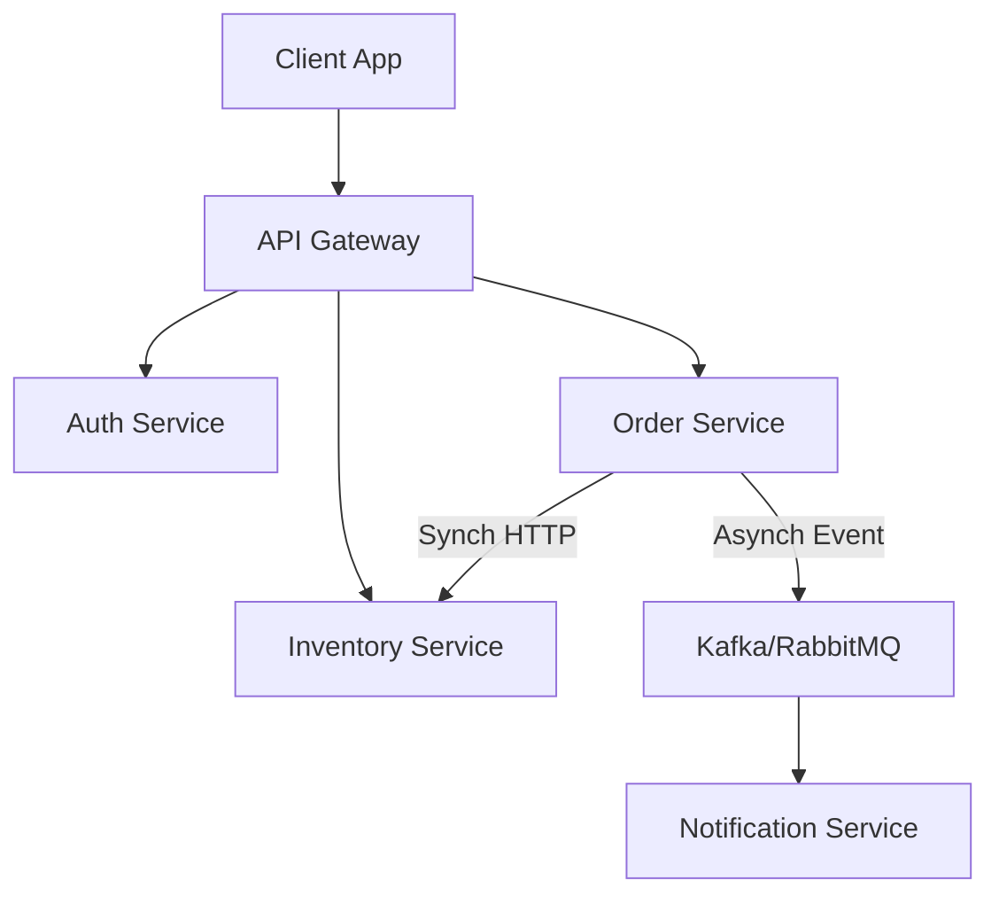

# ZeroLatency

_ZeroLatency_ is a backend engineering sandbox designed to simulate a high-throughput, low-latency distributed system.

This repository serves as a practical implementation environment for mastering Microservice Architecture, Spring Boot internals, advanced ORM optimization, and complex backend logic.

## Table of Contents

- [Introduction](#introduction)
- [Architecture](#architecture)
- [Tech Stack](#tech-stack)
- [Key Concepts & Patterns](#key-concepts--patterns)
- [Getting Started](#getting-started)
- [Roadmap](#roadmap)
- [License](#license)

## Introduction

The primary goal of ZeroLatency is not merely to produce a functional application, but to strictly implement production-grade patterns. It focuses on the specific challenges of distributed systems, including data consistency, fault tolerance, and performance optimization at the database level.

## Architecture

The system is designed as a distributed cluster of services communicating via REST (synchronous) and Message Brokers (asynchronous).

### Service Overview

- _Discovery Service:_ Service registry using Netflix Eureka.
- _API Gateway:_ Entry point for routing, rate limiting, and request aggregation.
- _Auth Service:_ Centralized identity management using OAuth2 and JWT.
- _Core Business Services:_ Independent microservices (Order, Inventory, Payment) handling domain logic.

### Diagram

